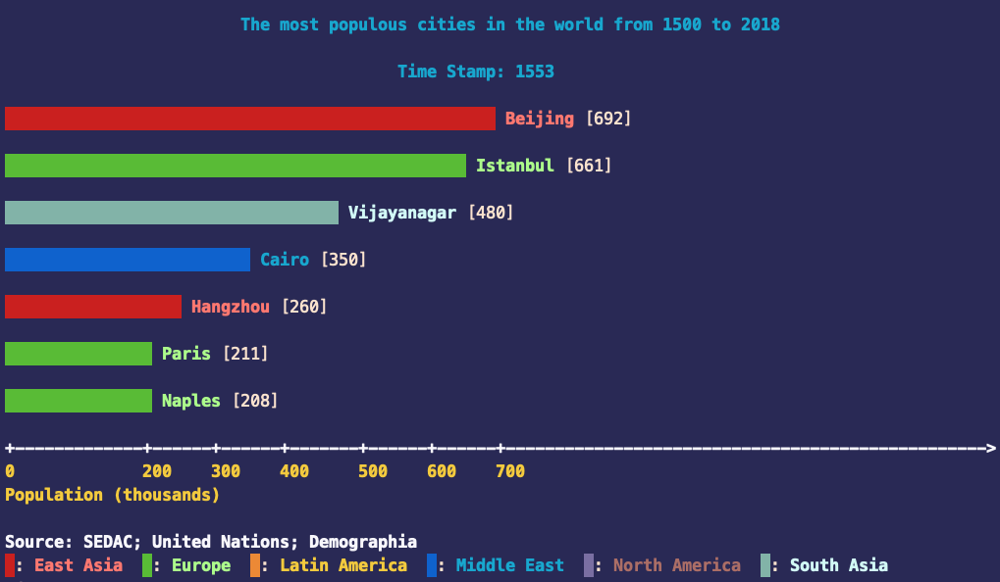
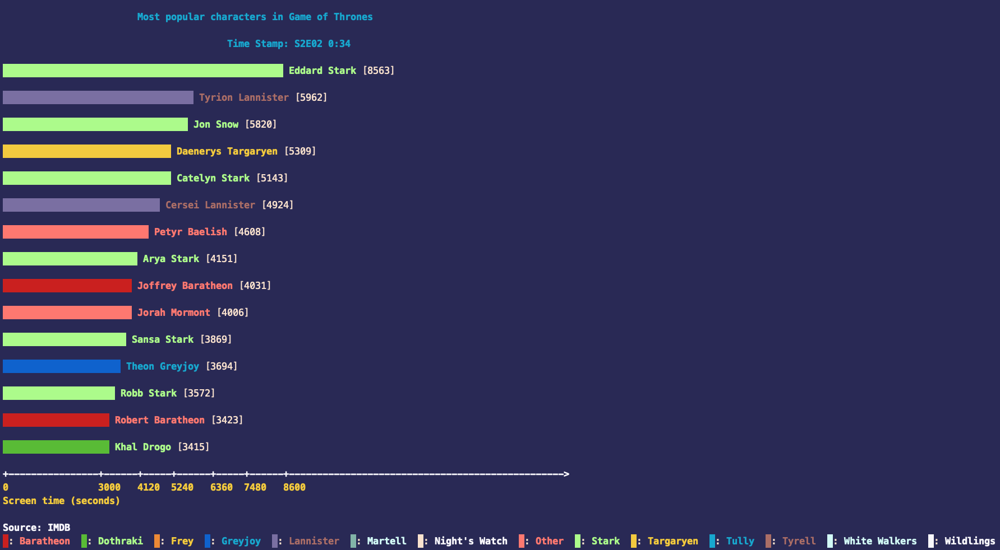
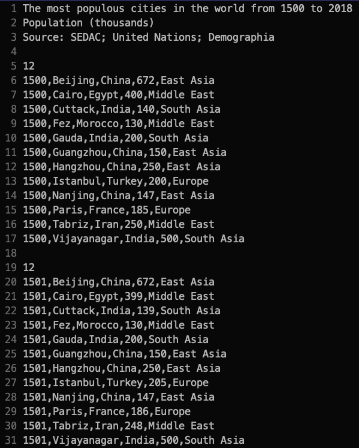
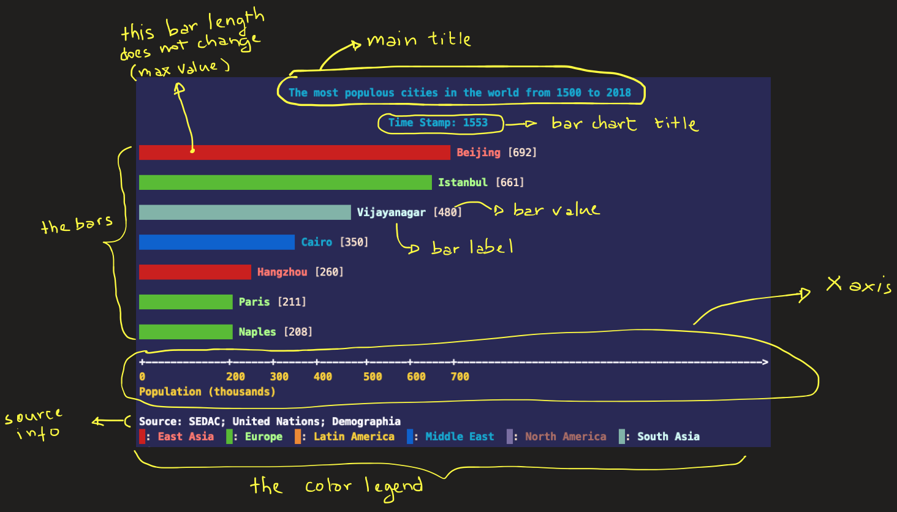

# Programming Assignment: The Bar Chart Race

### Table of Contents
1. [Introduction](#introduction)
2. [Input](#input)
3. [Interface](#interface)
4. [Execution](#execution)
5. [System Modeling](#system-modeling)
6. [Output](#output)
7. [Assignment Grading](#assignment-grading)
8. [Authorship and Collaboration Policy](#authorship-and-collaboration-policy)
9. [Work Submission](#work-submission)

#  Introduction


In this programming assignment you should design and develop a program named **bcr** (**b**ar **c**hart **r**ace) that provides a terminal version of a _bar chart animation_. This type of animation is primarily designed to help us understand data evolution over a period of time.

A bar chart is a **data visualization technique** that is often employed to present categorical data. In this assignment, one bar chart may be composed of up to 15 bars. A bar is represented by a horizontal rectangle whose length corresponds to the data value it represents. See the image below for an example of a single bar chart extracted from the database `cities.dat` that depicts the top 7 most populous cities in the world from 1500 to 2018[^1]. The color represent the continents (the category) the cities belong to.

[^1]: This database will be used throughout this document to illustrate some concepts.



This other example of bar chart represents the total screen time (in seconds) of characters from the Game of Thrones TV show, up to Season 02, Episode 02. In this case the categories are the family name or house the character belongs to.



The basic action of the `bcr` system is to read an input file with some data progressing over a period of time
and display them in sequence, creating an illusion of animation.

Before a chart is present, however, your program must sort the bars in decreasing order of length (i.e. value). The successive display of  _bar charts_, as their bars increase/decrease in length, resembles a _race_ where bars (data items) are trying to get to the top (the highest rank). Often we can see a bar overtaking other bars or being pushed down the chart. This type of animation helps users visualize the change in data trends over time.

See more basic information on Bar Chart [here](https://en.wikipedia.org/wiki/Bar_chart).

You may see the resulting bar race animation for the `cities.dat` dataset [here](bar_char_cities.mov).

# Input

Your system should read a ASCII file with comma separated values (.csv) containing all the data. The first three lines of the input file is called **header** and contains information on:

1. The title of the chart.
2. The label associated with the value portrayed in the chart.
3. The source of information.

After that comes a line with a single integer, let us called it `n_bars`, indicating how many lines of data should compose a single bar chart. This line is followed by `n_bars` lines, each containing information corresponding to a single **data item**, usually in the format:

> time_stamp, **label**, other_related_info, **value**, **category**
 
 See the image below that contains a snippet of the `cities.dat` database file.



The meaning of these fields are the following:

+ _time_stamp_:  the time stamp the data was captured on. In the `cities.dat` this is the year the data was captured in.
+ _label_: the data label. In the `cities.dat`this is the name of the city.
+ _other_related_info_: this is any other information related to the data item _that it is not going to be used in the visualization_. In the `cities.dat` this is the country the city belong to.
+ _value_: the value of the data item to be represented by a single bar in a chart. In the `cities.dat`this is the population of the city in thousands.
+ _category_: a category the data item belong to. This field may be used as a color mapping for individual bars. In the `cities.dat` this is the continent the city belongs to.

You may download several input data files [here](data.zip).

# Interface

You program should read command line arguments, as follows:
```
% ./bcr
Usage: bcr [<options>] <input_data_file>
  Bar Chart Race options:
      -b  <num> Max # of bars in a single char.
                Valid range is [1,15]. Default values is 5.
      -f  <num> Animation speed in fps (frames per second).
                Valid range is [1,24]. Default value is 24.
```

The **# of bars** options allows the user to specify how many bar he or she wishes to display in the animation. If the database has more bars than requested via command line, the program should display only what was requested in this option. On the other hand, if the number of bars in the database is less than what has been requested through the command line interface (CLI), you should display only the bars available; you cannot created more bars just because the user requested it, right?

The **fps** means the number of bar charts that should be displayed in a single second. If the user sets this value to 2, for instance, your program should display two bar charts in sequence every second.

Because the printing of such a simple data is quite fast (probably less than 1 millisecond), your program should _sleep_ (pause) for a while, so that the user can see the animation in the requested speed. An animation, in this context, is done just by printing out the sequence of bar charts in the terminal, _pausing_ the program for a short period of time, printing out the next bar chart, pausing for a while, and so on. This simple action will naturally make the terminal screen roll up, creating an "illusion" that the bar chart is animated, if the terminal height is set properly. What you need to do is determined how many milliseconds you program should be paused for, based on the `fps` value provided by the user. For instance, suppose the user requested `bcr -fps 12 citied.dat`; this means you have to pause the current thread for $`1000ms / 12 \approx 83ms`$. This can be done with the `<thread>` as follows:

```c++
#include <thread>
#include <iostream>

int main() {
	// Animation example
	for ( int i{0} ; i < 50 ; ++i ) {
		// This code pauses `duration` milliseconds between frames.
		// Convert fps to milliseconds.
		int fps{2};
		std::chrono::milliseconds  duration{ 1000/fps };
		std::this_thread::sleep_for( duration );
		std::cout << "This sentence will be printed on the standard output approximately " << fps << " times per second.\n";
	}
	return 0;
}
```


# Execution

After providing via terminal the database filename and the running options, your program should proceed and read all the information into memory and close de database file. Recall that the program will have a _collection_ of **bar chart**, which, in turn, is a collection of **bars**, which corresponds to a single data item in the input file.

Therefore you may create a struct, `BarItem` to represent a single data item or **bar**. You may also create a class `BarChart` that represents the entity _bar chart_, i.e., a collection of bars. The `BarChart` class may be modeled internally as, say, `std::vector< BarItem> bars;`. Besides the data items (bars), a bar chart has also a unique _time stamp_ (i.e. a `std::string`).

Once a single bar chart is completely read from the input file and instantiated (as an object), it is time to store this object in another object: the `Database`. This class represents a collection of all bar charts read from the input file. Again, you may choose to represent this as a `vector` of `BarCharts`.

At this point it is worth making a suggestion on how improve memory usage and the overall performance of your application. To avoid creating temporary `BarChart` objects, during the file reading process, and then copying them to the `Database` objects, you may allocate `BarChart` objects dynamically with `new` and make the `Database` keep a `vector` of **pointers** to `BarChart` objects. The best way to do this is with the so called **smart pointers**, implemented in C++ through the class `std::shared_ptr<>`. The difference between **smart** and **raw** (regular) pointers is that the former released its memory automatically if no other smart `shared_ptr` is pointing to the allocated memory block, whereas the latter requires the programmer to manually call the `delete` command to release the memory. In short: if you make use of smart pointers your program is less likely to have memory leaks, whereas in the raw pointer scenario, the programmer is entirely responsible for (correctly or incorrectly) managing the memory and, thus, the only responsible for any memory leaks that may happen.

After completing the reading of all data from the input file, the next step is to present the user with a summary of the information read from the input file and ask the user to hit enter to start the animation.

The snippet below summarize the top-level steps just described, to help you understand the relation between the suggested classes and the data reading process.

```c++
// Here goes the code to setup the database.

[1] Read the file header to get the title, the category label, and source information.
[2] While there is line to read:
	[2.1] Read a single integer `n_bars`: the total number of bars for the current bar chart.
	[2.2] Instantiate an empty `BarChart` object, say `bc` (this may require the use of raw or smart pointer)
	[2.3] Fixed loop to read `n_bars` lines from the input file
		[2.3.a] Read a single line and split its contents into a list of tokens: `time_stamp`, `label`, `dummy`, `value`, `category`
		[2.3.b] Create a `BarItem` with data read in [2.3.a] (`label`, `value`, and `category`) and add it to `bc` (created in [2.2]).
		[2.3.c] Insert the current bar `category` (from [2.3.a]) into a set of unique elements, so that we may have a list of existing categories at the end.
	[2.4] Store the `time_stamp` (of the last bar, for instance) as the overall `bc`'s time stamp.
	[2.5] Sort the bars of `bc` object, from highest bar value to the lowest bar value (this might be a method of the `BarChart` class)
	[2.6] Store the current (sorted) `bc` object into the Database object.
	// ... some time later
[3] Print out the summary of information read from the input file (title, sorce, # of bars) and ask user to proceed with the animation.
```

# System Modeling

If you are following the game-loop architecture, there are just a few states to consider. The _finite animation state machine_ goes through each of these stages in a linear sequence. 

+ **start**: the initial state.
+ **welcome**: welcome message.
+ **reading**: reading the input file.
+ **racing**: animating the bar charts.
+ **end**: finishing the program.

In terms of classes, you may create the following:

+ `AnimationManager`: This is the main class that controls and processes the command line arguments, reads the data, creates the database, and controls the animation. In case you are following the game-loop architecture presented in the previous assignment, this class should implement the methods:
	+ `initialize()`: processes the command line arguments and creates the basic objects, such as the database and the bar chart.
	+ `process()`: treats all the input action. If the program is in the **welcome** stage this method calls the the function that reads the input file. If the program is in the **reading** stage this method waits for the user to press enter to start the animation. If the program is in the **racing** stage this method should pause the execution for a few milliseconds to simulate the animation speed requested by the user in the **fps** input option.
	+ `update()`: updates the animation variables and the current program state, changing it from **start** all the way until the **end** state. When in the **racing** stage the program should move though the database, feeding the bar chart with information that will be presented to the user.
	+ `render()`: sends information to the standard output. Depending on the current stage, you may display a welcoming message, display a summary of information captured from the database, or display a single bar chart.
+ `Database`: This class holds all the information we wish to display in the form of bar charts.
+ `BarChart`: Represents a single bar chart, with title, bars, axis, color legend, etc.
+ `BarItem`: It is just a `struct` that contains three pieces of information associated with a bar: label, value, and category.

# Output

Your program should display a series of bar charts in sequence, pausing between them according to the value set in the **fps** option. 

Here goes a list of items a bar chart should present (the bar chart _anatomy_):

+ A _main title_ explaining what the data is all about. This information is present in the data file header.
+ A _bar char title_ for the current bar chart, indicating the date. This information is usually the first information in a data item line.
+ _The bars_: A sequence of **n** colored lines, where **n** is either the number of bars requested by the client in CLI, OR the amount of bars available in a single bar chart: whichever is smaller. 
	+ You should choose an arbitrary value to be the length of the largest bar, say `max_bar_len=45` characters.  This size does not change during the whole animation and should correspond to the _highest value_ found in a single bar chart. All the other bars should have their length set in proportion to the largest value ([cross multiplication](https://en.wikipedia.org/wiki/Cross-multiplication) or _"regra de três"_). At the right end of the bar, just outside the bar, you should write the _bar label_ and its _numerical value_ enclosed in brackets.
	+ The bars should always appear in descending order of length AND, of course, numeric value.
	+ The bar should be colored according to its category. In the case of the `cities.data`, for instance, there are six categories that are the continents the cities are located in. Your program should support at least 14 different colors. In case your program reads a database that has more than 14 categories, all the bars should be printed in a single color.
+ _The X axis_: This is a horizontal axis located just below the bars that helps locating reference values. The axis occupies two lines, one with a set of minus signs `-` and `+` marks in reference locations, and another line with numerical values associated with the `+` marks. By default your program should display at least 5 marks on the axis. The values of these marks **should be equally spaced between the lowest and the max values in the current bar chart**. This makes the axis's ticks **dynamic**, i.e. their numeric values change and, consequently, the `+` marks should move accordingly (please, see the example animation [here](bar_char_cities.mov), if this explanation is not clear enough).
+ _The source of information_: This is just a line indicating which entity produced the data. This information is available in the data file header.
+ _The color legend_: This is a color legend showing the association between the colors and the categories. In case the number of categories is larger than 14 your program does not need to present a color legend, because you should be using a single color for all bars.

The image below has all the components of a bar chart annotated.



# Assignment Grading

This assignment has a total of **100 points**. Bellow is a table with the description of the item under consideration and the assigned grade _if the item is totally correct_. Partial grade will be considered if the item is not fully correct.

Item     | Value (points)
-------- | :-----:
Read, validate, and process command line arguments | 5
Program runs with default values, if no options are provided | 5
Read the input data file and store the information in memory    | 10
Display a summary of the data read from the input file _before_ the animation starts | 5
Display a summary of the running options (set by the user or default values) _before_ the animation starts | 5
The project contains at least two classes | 10
Create individual bar charts containing all data items for a single date | 10
Run the bar chart animation at the correct speed | 10
The bar chart anatomy is complete and correct | 30
Program handles errors properly | 10

The following situations may take credits out of your assignment, if they happen during the evaluation process:

Item     | Value (points)
-------- | :-----:
Compiling and/or runtime errors  | -5
Missing code documentation in Doxygen style | -10
Memory leak | -10
[`author.md`](author.md) file not filled out | -10

The [`author.md`](author.md) file should contain a brief description of the project, and how to run it. It also should describe possible errors, limitations, or issues found. Do not forget to include the author name!

# Authorship and Collaboration Policy

This is an **individual assignment**. You may be called for an interview. The purpose of the interview is to confirm the authorship of the assignment and to ask for explanations on specific points of the code. During the interview, you should be capable of explaining any piece of code. After the interview, the assignment’s credits may be reviewed.

The cooperation among students is strongly encouraged. It is accepted the open discussion of ideas or development strategies. Notice, however, that this type of interaction should not be understood as a free permission to copy and use somebody else’s code. This is may be interpreted as plagiarism.

Any two (or more) programs deemed as plagiarism will automatically receive no credits, regardless of the real authorship of the programs involved in the case. If your project uses a (small) piece of code from someone else’s, please provide proper acknowledgment in the [`author.md`](author.md) file.

# Work Submission

You may submit your work in two possible ways: via GitHub Classroom (GHC), or, via Sigaa submission task. In case you decide to send your work via GHC you _must_ also send a text file via Sigaa submission task with the github link to your repository. In case you choose to send your work via Sigaa only, send a zip file containing all the code necessary to compile and run the project.

I any of these two ways, remember to remove all the executable files (i.e. the `build` folder) from your project before handing in your work.

--------
&copy; DIMAp/UFRN 2020.
